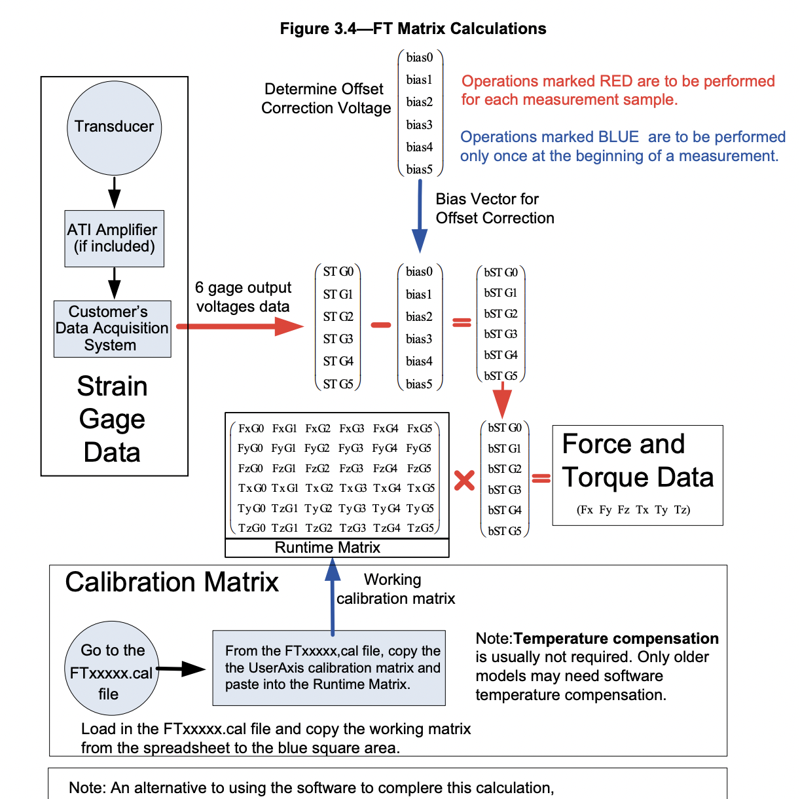

# How to use F/T sensor ATI mini 45 with LabJack and M1mac

## Reference
Manual for ATI 45 mini with DAQ: https://www.ati-ia.com/app_content/documents/9620-05-DAQ.pdf

Calibration Matrix: https://www.ati-ia.com/library/software/ftdigitaldownload/getcalfiles.aspx


## Install
### Install LabJack Exodriver
LabJack support only low level interface called Exodriver for macOS. You need to install it.
https://labjack.com/pages/support?doc=/software-driver/installer-downloads/exodriver/

Make sure that gcc(Xcode) have alreadly been installed before installing Exodriver.

### Install LabJackPython
https://github.com/labjack/LabJackPython

### Set Calibration Matrix to "userAxis"
The diagram below (cited from ATI manual) shows the calibration process. You need to get Calibration Matrix for your sensor, caliculated by ATI. The calibration file is available on their website. https://www.ati-ia.com/library/software/ftdigitaldownload/getcalfiles.aspx



## Run
```
# python3 force-torque-sensor.py
```

## Notice
I have know idea about the mechanism, but I found that light condition affects the output of the sensor. I made a mounter that can cover the sensor.